# Multi-Cluster Kubernetes System Design Document

**Pre-Production Environment**  
**Version:** 1.0  
**Date:** December 18, 2025

---

## Table of Contents

1. [Executive Summary](#executive-summary)
2. [System Architecture Overview](#system-architecture-overview)
3. [Infrastructure Components](#infrastructure-components)
4. [Cluster Topology](#cluster-topology)
5. [Networking Architecture](#networking-architecture)
6. [Security Architecture](#security-architecture)
7. [Storage Architecture](#storage-architecture)
8. [Service Mesh Architecture](#service-mesh-architecture)
9. [Monitoring and Observability](#monitoring-and-observability)
10. [Application Stack](#application-stack)
11. [Deployment Architecture](#deployment-architecture)
12. [Security Best Practices Assessment](#security-best-practices-assessment)
13. [Recommendations and Improvements](#recommendations-and-improvements)
14. [Appendices](#appendices)

---

## Executive Summary

This document describes a sophisticated multi-cluster Kubernetes deployment architecture designed for high availability, service mesh integration, and comprehensive monitoring. The system comprises **four Kubernetes clusters** deployed across multiple sites with advanced networking, storage, and security capabilities.

### Key Characteristics

- **Multi-cluster architecture** with Istio service mesh spanning all clusters
- **Geographic distribution** across three sites (j52, j64, r01)
- **MongoDB multi-cluster replication** for data resilience
- **Centralized monitoring** with Prometheus federation
- **Enterprise-grade storage** with NetApp Trident
- **Microservices deployment** running Rocket.Chat as primary application

---

## System Architecture Overview

### Architecture Diagram

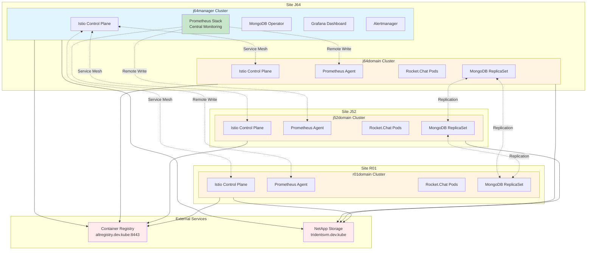

### Cluster Overview

| Cluster | Site | Role | Primary Functions |
|---------|------|------|------------------|
| **j64manager** | J64 | Management/Control | MongoDB Operator, Central Monitoring, Istio Primary |
| **j64domain** | J64 | Application | Rocket.Chat, MongoDB ReplicaSet, Istio Data Plane |
| **j52domain** | J52 | Application | Rocket.Chat, MongoDB ReplicaSet, Istio Data Plane |
| **r01domain** | R01 | Application | Rocket.Chat, MongoDB ReplicaSet, Istio Data Plane |

---

## Infrastructure Components

### Core Platform Components

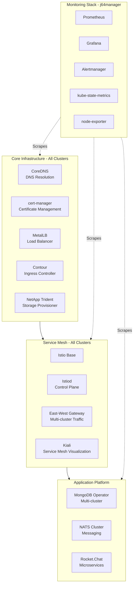

### Component Versions

| Component | Version | Registry |
|-----------|---------|----------|
| **Istio** | 1.27.1 | altregistry.dev.kube:8443/library/istio |
| **cert-manager** | 1.5.14 (Bitnami) | altregistry.dev.kube:8443/library |
| **MetalLB** | 0.15.2 | altregistry.dev.kube:8443/library/metallb |
| **Contour** | 21.1.4 (Bitnami) | altregistry.dev.kube:8443/library |
| **Trident** | 100.2510.0 | altregistry.dev.kube:8443/library/netapp |
| **Prometheus Stack** | 80.2.0 (kube-prometheus-stack) | altregistry.dev.kube:8443/library |
| **MongoDB Kubernetes** | 1.5.0 | altregistry.dev.kube:8443/library/mongodb |
| **NATS** | 2.12.2 | altregistry.dev.kube:8443/library |
| **Rocket.Chat** | 7.13.1 | altregistry.dev.kube:8443/library/rocketchat |
| **Kiali Operator** | 2.13.0 | altregistry.dev.kube:8443/library |

---

## Cluster Topology

### Cluster Network Topology

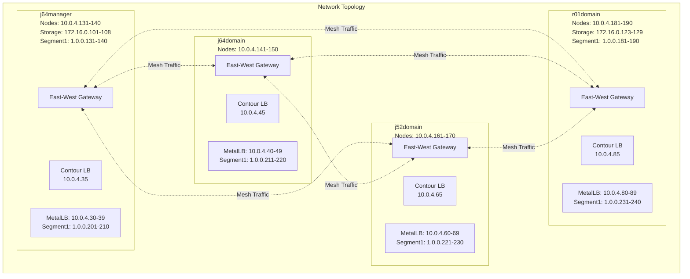

### IP Address Allocation

#### Network Port Groups

- **hardware:** 10.231.3.131 - 10.231.3.254 (vSphere Supervisor Control Plane)
- **kubes-domain:** 10.0.4.0/24 (Kubernetes Admin, Cluster Nodes, and App Services)
- **netapp-1001:** 172.16.0.101 - 172.16.0.130 (Kubernetes Cluster Nodes for Persistent Volumes)
- **segment1:** 1.0.0.128/25 (Kubernetes Cluster Nodes and App Services)

#### j64manager Cluster

- **Node IPs (kubes-domain):** 10.0.4.131 - 10.0.4.140
- **Storage IPs (netapp-1001):** 172.16.0.101 - 172.16.0.108
- **Segment1 IPs:** 1.0.0.131 - 1.0.0.140
- **Domain MetalLB Pool:** 10.0.4.30 - 10.0.4.39
- **Segment1 MetalLB Pool:** 1.0.0.201 - 1.0.0.210
- **Contour LoadBalancer (Domain):** 10.0.4.35
- **Contour LoadBalancer (Segment1):** 1.0.0.205
- **Cluster Service CIDR:** 10.93.0.0/16
- **Pod Network CIDR:** 10.243.0.0/16

#### j64domain Cluster

- **Node IPs (kubes-domain):** 10.0.4.141 - 10.0.4.150
- **Storage IPs (netapp-1001):** 172.16.0.109 - 172.16.0.115
- **Segment1 IPs:** 1.0.0.141 - 1.0.0.150
- **Domain MetalLB Pool:** 10.0.4.40 - 10.0.4.49
- **Segment1 MetalLB Pool:** 1.0.0.211 - 1.0.0.220
- **Contour LoadBalancer (Domain):** 10.0.4.45
- **Contour LoadBalancer (Segment1):** 1.0.0.215
- **Cluster Service CIDR:** 10.94.0.0/16
- **Pod Network CIDR:** 10.244.0.0/16

#### j52domain Cluster

- **Node IPs (kubes-domain):** 10.0.4.161 - 10.0.4.170
- **Storage IPs (netapp-1001):** 172.16.0.116 - 172.16.0.122
- **Segment1 IPs:** 1.0.0.161 - 1.0.0.170
- **Domain MetalLB Pool:** 10.0.4.60 - 10.0.4.69
- **Segment1 MetalLB Pool:** 1.0.0.221 - 1.0.0.230
- **Contour LoadBalancer (Domain):** 10.0.4.65
- **Contour LoadBalancer (Segment1):** 1.0.0.225
- **Cluster Service CIDR:** 10.96.0.0/16
- **Pod Network CIDR:** 10.246.0.0/16

#### r01domain Cluster

- **Node IPs (kubes-domain):** 10.0.4.181 - 10.0.4.190
- **Storage IPs (netapp-1001):** 172.16.0.123 - 172.16.0.129
- **Segment1 IPs:** 1.0.0.181 - 1.0.0.190
- **Domain MetalLB Pool:** 10.0.4.80 - 10.0.4.89
- **Segment1 MetalLB Pool:** 1.0.0.231 - 1.0.0.240
- **Contour LoadBalancer (Domain):** 10.0.4.85
- **Contour LoadBalancer (Segment1):** 1.0.0.235
- **Cluster Service CIDR:** 10.98.0.0/16
- **Pod Network CIDR:** 10.248.0.0/16

---

## Networking Architecture

### Load Balancing Architecture

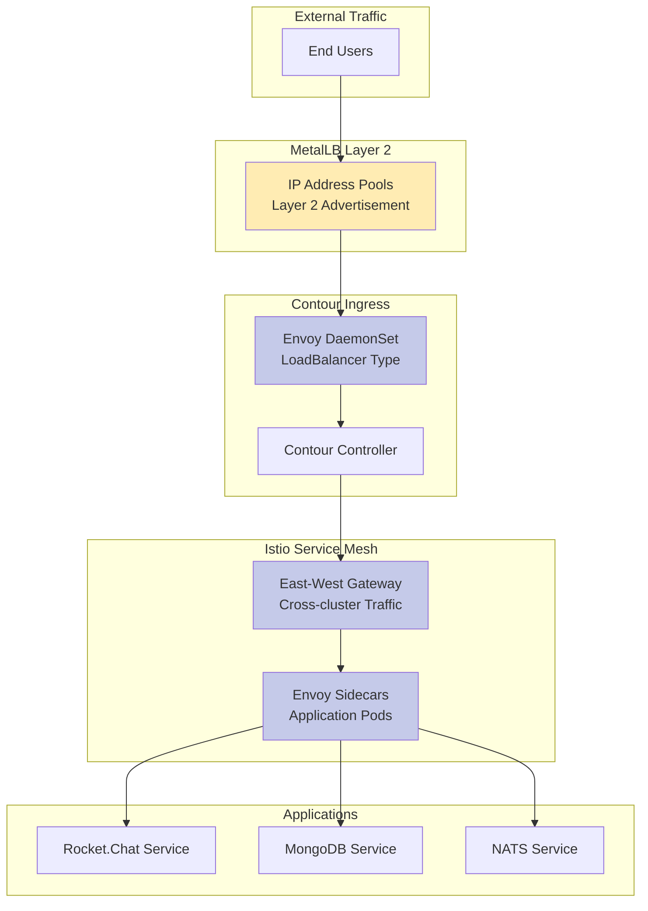

### MetalLB Configuration

**Controller Resources:**

- CPU: 50m request / 500m limit
- Memory: 50Mi request / 512Mi limit

**Speaker Configuration:**

- Mode: Layer 2 Advertisement
- FRR Integration: Enabled (v10.4.1)
- CPU: 50m request / 500m limit
- Memory: 50Mi request / 512Mi limit

### Contour Ingress

**Deployment:**

- Controller: 1 replica
- Envoy: DaemonSet mode
- Service Type: LoadBalancer

---

## Security Architecture

### Certificate Management

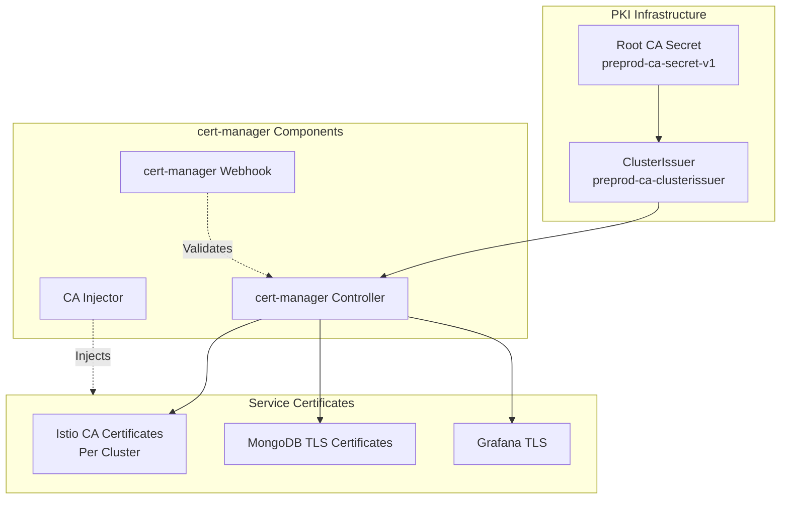

### Istio Security Architecture

**Multi-cluster Service Mesh Security:**

- **Mesh ID:** preprod-mesh1
- **Trust Domain:** cluster.local
- **Certificate Signers:** clusterissuers.cert-manager.io/preprod-ca-clusterissuer
- **mTLS:** Enabled cluster-wide
- **CA Certificates:** Unique per cluster (istio-{site}{cluster}-cacerts)

**Cross-cluster Authentication:**

- Service Account tokens exchanged between clusters
- Remote secrets created for API server access
- Secure east-west gateway communication (port 15443)

### Pod Security Standards

**Applied to All Namespaces:**

```yaml
pod-security.kubernetes.io/enforce: privileged
pod-security.kubernetes.io/audit: privileged
pod-security.kubernetes.io/warn: privileged
```

**Current Status:** ⚠️ **All namespaces use privileged mode**

**Security Labels Applied:**

- istio-system
- cert-manager
- metallb-system
- contour
- trident-system
- mongodb-operator
- mongodb
- nats-system
- rocketchat
- monitoring

### RBAC Configuration

**Service Accounts:**

- cert-manager controller, webhook, cainjector
- MetalLB controller, speaker
- Contour controller, Envoy
- Istio istiod, gateway
- MongoDB Kubernetes Operator
- Prometheus Operator
- NATS
- Rocket.Chat

**Cluster-level Permissions:**

- MongoDB Operator: cluster-admin role (multi-cluster management)
- Prometheus: Cluster monitoring permissions
- cert-manager: Certificate management across namespaces

---

## Storage Architecture

### NetApp Trident Integration

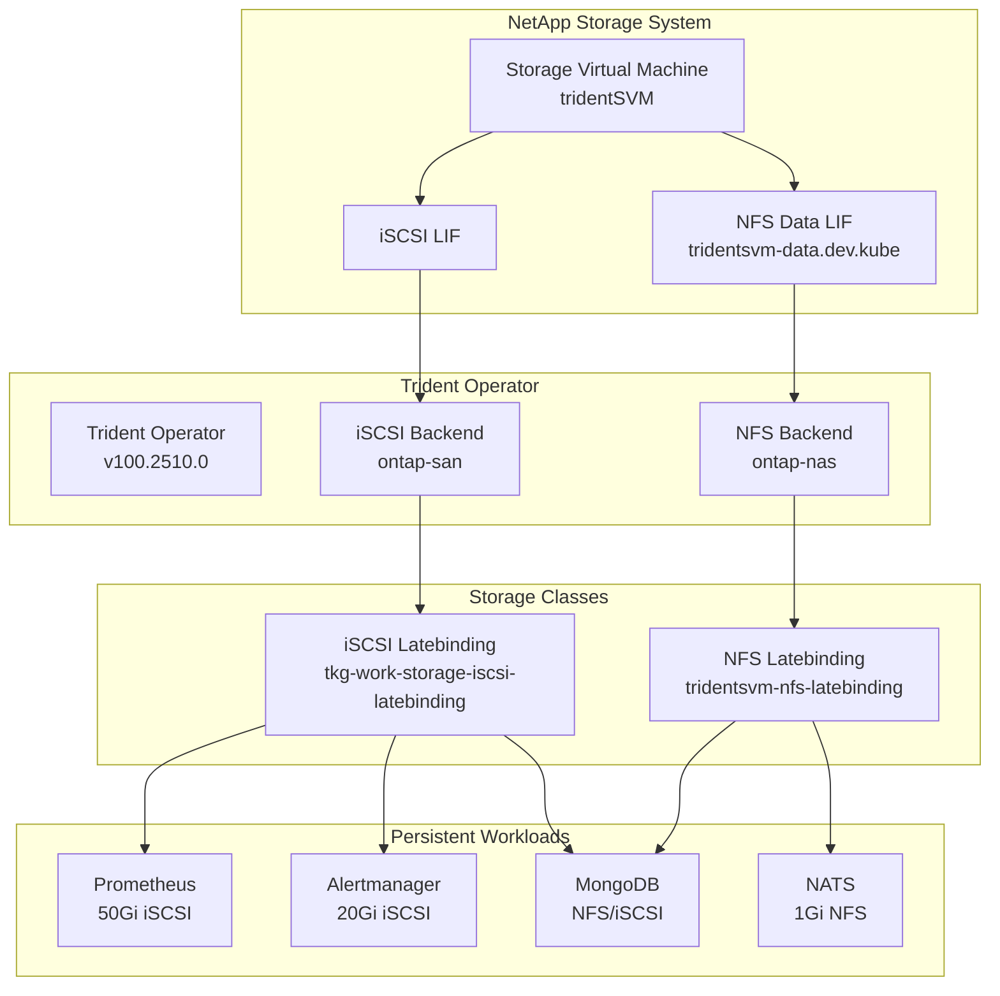

### Storage Backend Configuration

**NFS Backend (ontap-nas):**

- Driver: ontap-nas
- Management LIF: tridentsvm.dev.kube
- Data LIF: tridentsvm-data.dev.kube
- SVM: tridentSVM
- Auto Export Policy: Enabled
- Credentials: Kubernetes Secret (tridentsvm-credentials-secret)

**iSCSI Backend (ontap-san):**

- Driver: ontap-san
- Management LIF: tridentsvm.dev.kube
- SVM: tridentSVM
- CHAP: Not configured (recommended to enable)
- Credentials: Kubernetes Secret (tridentsvm-credentials-secret)

### Storage Classes

| Storage Class | Provisioner | Access Mode | Use Case |
|---------------|-------------|-------------|----------|
| tridentsvm-nfs-latebinding | ontap-nas | RWX | Shared storage, NATS |
| tkg-work-storage-iscsi-latebinding | ontap-san | RWO | Block storage, databases |
| tkg-work-storage-latebinding | N/A | RWO | General purpose |

---

## Service Mesh Architecture

### Istio Multi-cluster Configuration

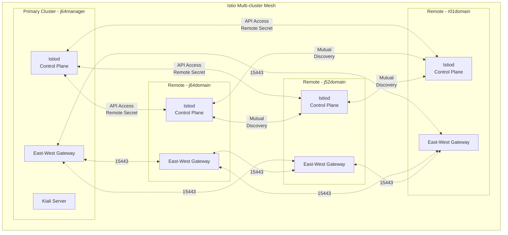

### Mesh Networks Configuration

| Network | Cluster | Gateway Address (Domain) | Gateway Address (Segment1) | Port |
|---------|---------|-------------------------|----------------------------|------|
| j64manager-net1 | j64manager | Via MetalLB Pool | Via MetalLB Pool | 15443 |
| j64domain-net1 | j64domain | Via MetalLB Pool | Via MetalLB Pool | 15443 |
| j52domain-net1 | j52domain | Via MetalLB Pool | Via MetalLB Pool | 15443 |
| r01domain-net1 | r01domain | Via MetalLB Pool | Via MetalLB Pool | 15443 |

**Note:** East-west gateways use LoadBalancer services assigned from MetalLB pools. Domain network uses kubes-domain IPs (10.0.4.x), while segment1 uses alternative network IPs (1.0.0.x).

### Istio Components Resources

**Istiod (Control Plane):**

- CPU: 100m request / 1000m limit
- Memory: 128Mi request / 1024Mi limit
- Logging Level: debug
- Revision: stable

**East-West Gateway:**

- Deployment per cluster
- Dedicated gateway for cross-cluster traffic
- Port 15443 (TLS)

**Proxy (Sidecars):**

- CPU: 100m request / 1000m limit
- Memory: 128Mi request / 512Mi limit
- Log Level: debug

### Kiali Visualization

**Deployment:**

- Kiali Operator: 2.13.0
- Kiali Server: 2.13.0
- Namespace: istio-system
- Provides service mesh topology and health visualization

---

## Monitoring and Observability

### Monitoring Architecture

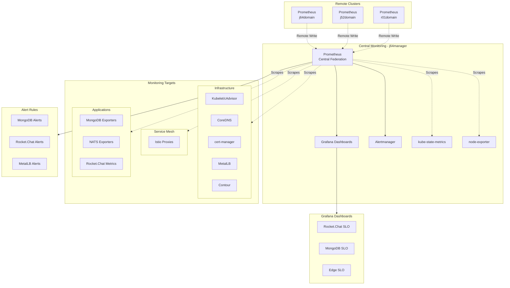

### Prometheus Configuration (j64manager)

**Resource Allocation:**

- CPU: 1 core request / unlimited limit
- Memory: 4Gi request / 12Gi limit
- Replicas: 1

**Storage:**

- Type: Persistent Volume (iSCSI)
- Size: 50Gi
- Storage Class: tkg-work-storage-iscsi-latebinding
- Retention: 15 days

**Scrape Configuration:**

- Scrape Interval: 15s
- Scrape Timeout: 10s
- Evaluation Interval: 15s
- Remote Write Receiver: Enabled

**Features:**

- External Labels: cluster=j64manager
- Prometheus External Label Name: j64manager

### ServiceMonitors Configured

| Name | Namespace | Selector | Endpoint | Interval |
|------|-----------|----------|----------|----------|
| **rocketchat** | rocketchat | app.kubernetes.io/name: rocketchat | /metrics | 30s |
| **mongodb-rocketchat** | mongodb | app.kubernetes.io/name: mongodb-exporter | /metrics | 30s |
| **metallb-controller** | metallb-system | component: controller | /metrics | 30s |
| **metallb-speaker** | metallb-system | component: speaker | /metrics | 30s |
| **nats-exporter** | nats-system | app.kubernetes.io/name: prometheus-nats-exporter | /metrics | 15s |
| **cert-manager** | cert-manager | app.kubernetes.io/name: cert-manager | /metrics | 30s |
| **contour** | contour | app.kubernetes.io/name: contour | /metrics | 30s |

### PodMonitors Configured

| Name | Namespaces | Selector | Endpoint | Interval |
|------|------------|----------|----------|----------|
| **istio-proxies** | ALL | istio-prometheus-scrape: 'true' | /stats/prometheus | 15s |

### Kubelet Monitoring

**Enabled Components:**

- kubelet metrics
- cAdvisor metrics (15s interval, 7s timeout)
- Resource metrics
- Track timestamps staleness: false

### Grafana Configuration

**Resource Allocation:**

- CPU: 100m request / 500m limit
- Memory: 256Mi request / 1Gi limit

**Configuration:**

- Domain: j64manager-grafana.dev.kube
- Root URL: <https://j64manager-grafana.dev.kube>
- Admin Credentials: Kubernetes Secret (grafana-admin-credentials)

**Sidecar Configuration:**

- Dashboards: Enabled (label: grafana_dashboard)
- Datasources: Enabled
- Search Namespace: ALL

### Alertmanager Configuration

**Resource Allocation:**

- CPU: 100m request / 500m limit
- Memory: 128Mi request / 512Mi limit
- Replicas: 1

**Storage:**

- Type: Persistent Volume (iSCSI)
- Size: 20Gi
- Storage Class: tkg-work-storage-iscsi-latebinding
- Retention: 120h

### Monitoring Dashboards

#### Rocket.Chat SLO Dashboard

**Metrics:**

- API Availability (5xx error budget)
- API Latency p95
- API 5xx Error Rate
- Request duration histograms

**Queries:**

```promql
# Availability
100 - (100 * sum(rate(http_requests_total{job="rocketchat",status=~"5.."}[5m])) / sum(rate(http_requests_total{job="rocketchat"}[5m])))

# P95 Latency
histogram_quantile(0.95, sum by (le) (rate(http_request_duration_seconds_bucket{job="rocketchat",route=~"/api/.*"}[5m])))
```

#### MongoDB SLO Dashboard

**Metrics:**

- Replication Lag p95 (seconds)
- Replication Lag per Member
- Active Connections
- Replica Set Health

**Queries:**

```promql
# Replication Lag
quantile_over_time(0.95, max by (cluster, replicaset) (mongodb_mongod_replset_member_replication_lag{app_kubernetes_io_instance="rocketchat"})[1h])
```

### Alert Rules

#### MongoDB Replication Alerts

**MongoReplicationLagHigh (Warning):**

```yaml
expr: max by (cluster, replicaset) (mongodb_mongod_replset_member_replication_lag{app_kubernetes_io_instance="rocketchat"}) > 10
for: 5m
severity: warning
```

**MongoReplicationLagCritical (Critical):**

```yaml
expr: max by (cluster, replicaset) (mongodb_mongod_replset_member_replication_lag{app_kubernetes_io_instance="rocketchat"}) > 60
for: 5m
severity: critical
```

#### Rocket.Chat API Alerts

**RocketChatApiLatencyHigh (Warning):**

```yaml
expr: histogram_quantile(0.95, sum by (le, cluster) (rate(http_request_duration_seconds_bucket{job="rocketchat",route=~"/api/.*"}[5m]))) > 0.5
for: 10m
severity: warning
```

**RocketChatApiErrorRateHigh (Critical):**

```yaml
expr: (sum(rate(http_requests_total{job="rocketchat",status=~"5.."}[5m])) / sum(rate(http_requests_total{job="rocketchat"}[5m]))) > 0.01
for: 5m
severity: critical
```

#### MetalLB Alerts

**MetalLBBgpSessionDown (Critical):**

```yaml
expr: metallb_bgp_session_up == 0
for: 1m
severity: critical
```

**MetalLBBgpSessionFlapping (Warning):**

```yaml
expr: changes(metallb_bgp_session_up[5m]) > 4
for: 5m
severity: warning
```

### kube-state-metrics

**Resource Allocation:**

- CPU: 50m request / 500m limit
- Memory: 100Mi request / 512Mi limit

**Metrics Exposed:**

- Deployment status
- Pod status
- Node status
- ReplicaSet status
- StatefulSet status
- DaemonSet status
- Service status
- ConfigMap/Secret counts

### node-exporter

**Deployment:** DaemonSet on all nodes

**Resource Allocation:**

- CPU: 50m request / 500m limit
- Memory: 50Mi request / 512Mi limit

**Metrics Exposed:**

- Node CPU usage
- Node memory usage
- Node disk I/O
- Node network I/O
- Node filesystem metrics

---

## Application Stack

### MongoDB Multi-cluster Architecture

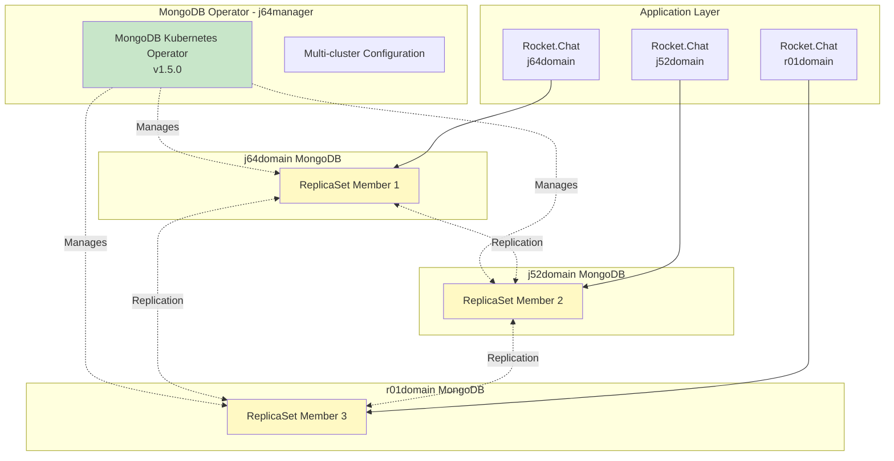

### MongoDB Operator Configuration

**Deployment:**

- Namespace: mongodb-operator (all clusters)
- Version: 1.5.0
- Multi-cluster: Enabled

**Multi-cluster Settings:**

```yaml
clusters: [j64manager, j64domain, j52domain, r01domain]
kubeConfigSecretName: mongodb-enterprise-operator-multi-cluster-kubeconfig
performFailOver: true
clusterClientTimeout: 10
needsCAInfrastructure: true
```

**Operator Resources:**

- CPU: 500m request / 1 core limit
- Memory: 300Mi request / 1Gi limit
- Replicas: 1

**Security:**

- managedSecurityContext: false
- Vault Secret Backend: Disabled

**Watched Resources:**

- opsmanagers
- mongodb
- mongodbmulticluster
- mongodbusers

### MongoDB ReplicaSet

**Configuration:**

- Multi-cluster replication across 3 sites
- TLS Enabled with CA bundle
- MongoDB Exporter for Prometheus metrics
- Persistent storage via Trident

**Connection String:**

```
mongodb://[credentials]@mongodb-service?ssl=true&tlsCAFile=/etc/ssl/mongo/ca.pem
```

### NATS Cluster

**Deployment:**

- Namespace: nats-system
- Version: 2.12.2
- Mode: Cluster (3 replicas)

**Cluster Configuration:**

```yaml
cluster:
  enabled: true
  port: 6222
  replicas: 3
  useFQDN: true
```

**Monitoring:**

- Port: 8222
- Prometheus Exporter: Disabled (should be enabled)

**Storage:**

- PVC Enabled: true
- Size: 1Gi
- Storage Class: tridentsvm-nfs-latebinding

**Resources:**

- CPU: 100m request / 500m limit
- Memory: 128Mi request / 360Mi limit

### Rocket.Chat Microservices

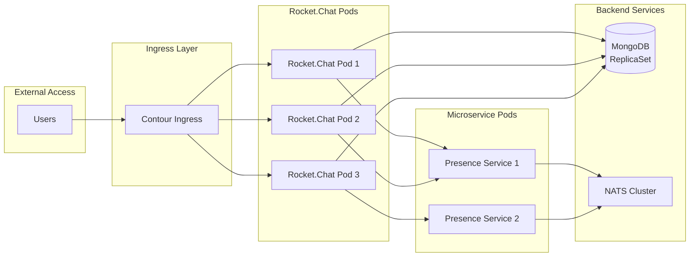

**Deployment:**

- Namespace: rocketchat
- Version: 7.13.1
- Replicas: 3 (main), 2 (presence)
- Min Available: 3

**Anti-affinity:**

```yaml
requiredDuringSchedulingIgnoredDuringExecution:
  topologyKey: kubernetes.io/hostname
```

**Resources (Main Pods):**

- CPU: 500m request / 2 cores limit
- Memory: 2Gi request / 4Gi limit

**Resources (Presence Microservice):**

- CPU: 250m request / 500m limit
- Memory: 512Mi request / 1Gi limit

**MongoDB Integration:**

- External MongoDB: Enabled
- TLS: Enabled
- CA Bundle: Mounted at /etc/ssl/mongo
- Connection managed via Kubernetes Secret

**Monitoring:**

- Metrics Port: HTTP (Prometheus scraping)
- ServiceMonitor: Configured

---

## Deployment Architecture

### Deployment Sequence

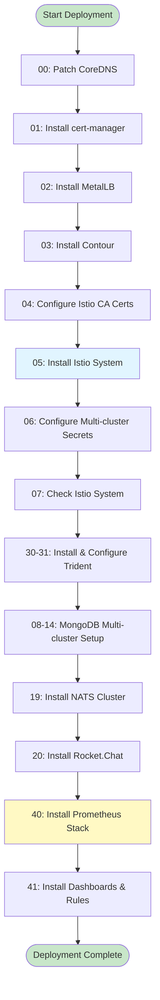

### Deployment Scripts

**Main Orchestration:**

- Script: `deploy-cluster.sh`
- Parameters: SITE, CLUSTER
- Base Directory: /home/adminlocal/k8s-mystical-mesh/build/install

**Deployment Steps:**

| Step | Script | Component | Description |
|------|--------|-----------|-------------|
| 00 | patch-coredns-v1.sh | CoreDNS | Apply RKE2 DNS patches |
| 01 | install-cert-manager.sh | cert-manager | Install certificate management |
| 02 | install-metallb.sh | MetalLB | Install load balancer |
| 03 | install-contour-ingress.sh | Contour | Install ingress controller |
| 04 | configure-istio-cacerts.sh | Istio | Configure CA certificates |
| 05 | install-istio-system.sh | Istio | Install service mesh |
| 06 | configure-istio-multicluster-secrets.sh | Istio | Setup cross-cluster auth |
| 07 | check-istio-system.sh | Istio | Verify installation |
| 08-14 | MongoDB scripts | MongoDB | Multi-cluster database setup |
| 19 | install-nats-cluster.sh | NATS | Install messaging system |
| 20 | install-rocketchat.sh | Rocket.Chat | Install application |
| 30-31 | Trident scripts | Storage | Install storage provisioner |
| 40 | install-prometheus-stack.sh | Monitoring | Install monitoring stack |
| 41 | install-grafana-dashboard-rules.sh | Monitoring | Install dashboards & alerts |

### Configuration Management

**Structure:**

```
build/sites/
├── all/                    # Shared configurations
│   ├── values/            # Common Helm values
│   └── resources/         # Common K8s resources
├── j64/
│   ├── manager-cluster/   # j64manager specific
│   │   ├── values/
│   │   └── resources/
│   └── domain-cluster/    # j64domain specific
│       ├── values/
│       └── resources/
├── j52/
│   └── domain-cluster/
└── r01/
    └── domain-cluster/
```

**Helm Charts:**

- Location: /home/adminlocal/k8s-mystical-mesh/helm/packages
- Format: Packaged .tgz files
- Registry: altregistry.dev.kube:8443/library

---

## Security Best Practices Assessment

### ✅ Current Security Strengths

1. **Certificate Management:**
   - ✅ Centralized cert-manager with ClusterIssuer
   - ✅ Automated certificate lifecycle
   - ✅ Root CA properly stored as Kubernetes Secret
   - ✅ Istio mTLS enabled cluster-wide

2. **Network Security:**
   - ✅ Service mesh with mTLS
   - ✅ Istio sidecar injection
   - ✅ Namespace isolation
   - ✅ TLS for MongoDB connections

3. **RBAC Configuration:**
   - ✅ Service accounts for all components
   - ✅ Role-based access control enabled
   - ✅ Namespace-scoped permissions where appropriate

4. **Image Security:**
   - ✅ Private container registry
   - ✅ Image pull policies defined
   - ✅ Specific image versions (not :latest)

### ⚠️ Security Concerns and Recommendations

#### 1. Pod Security Standards - **CRITICAL**

**Issue:** All namespaces use `privileged` Pod Security Standard

```yaml
pod-security.kubernetes.io/enforce: privileged
pod-security.kubernetes.io/audit: privileged
pod-security.kubernetes.io/warn: privileged
```

**Recommendation:**

- Migrate to `restricted` or `baseline` where possible
- Only use `privileged` for system components that require it
- Suggested migration:

```yaml
# System namespaces (keep privileged)
- istio-system: privileged
- metallb-system: privileged
- trident-system: privileged

# Application namespaces (migrate to baseline)
- rocketchat: baseline
- mongodb: baseline
- nats-system: baseline
- monitoring: baseline

# Infrastructure (migrate to restricted where possible)
- cert-manager: baseline
- contour: baseline
```

#### 2. Network Policies - **HIGH PRIORITY**

**Issue:** No NetworkPolicies detected in configuration

**Recommendation:** Implement NetworkPolicies for defense-in-depth:

```yaml
# Example: MongoDB namespace
apiVersion: networking.k8s.io/v1
kind: NetworkPolicy
metadata:
  name: mongodb-netpol
  namespace: mongodb
spec:
  podSelector:
    matchLabels:
      app: mongodb
  policyTypes:
  - Ingress
  - Egress
  ingress:
  - from:
    - namespaceSelector:
        matchLabels:
          name: rocketchat
    - namespaceSelector:
        matchLabels:
          name: monitoring
    ports:
    - protocol: TCP
      port: 27017
  egress:
  - to:
    - namespaceSelector:
        matchLabels:
          name: mongodb
    ports:
    - protocol: TCP
      port: 27017
  - to:
    - namespaceSelector: {}
    ports:
    - protocol: TCP
      port: 53
    - protocol: UDP
      port: 53
```

#### 3. Storage Security - **MEDIUM PRIORITY**

**Issue:** iSCSI backend doesn't have CHAP authentication enabled

**Recommendation:**

```yaml
# Enable bidirectional CHAP
spec:
  storageDriverName: ontap-san
  useCHAP: true
  chapUsername: "<secure-username>"
  chapInitiatorSecret: "<initiator-secret>"
  chapTargetInitiatorSecret: "<target-secret>"
```

#### 4. Secret Management - **MEDIUM PRIORITY**

**Issue:** Secrets stored as plain Kubernetes Secrets (base64 encoded)

**Recommendation:**

- Consider implementing HashiCorp Vault integration
- MongoDB Operator supports Vault backend:

```yaml
vaultSecretBackend:
  enabled: true
  tlsSecretRef: 'vault-tls-secret'
```

#### 5. Monitoring Credentials - **LOW PRIORITY**

**Issue:** Grafana admin credentials in Kubernetes Secret

**Recommendation:**

- Integrate with corporate SSO/LDAP
- Enable RBAC within Grafana
- Consider OAuth2 proxy

#### 6. Resource Quotas - **MEDIUM PRIORITY**

**Issue:** No ResourceQuotas detected for namespaces

**Recommendation:** Implement ResourceQuotas to prevent resource exhaustion:

```yaml
apiVersion: v1
kind: ResourceQuota
metadata:
  name: namespace-quota
  namespace: rocketchat
spec:
  hard:
    requests.cpu: "10"
    requests.memory: 20Gi
    limits.cpu: "20"
    limits.memory: 40Gi
    persistentvolumeclaims: "10"
```

#### 7. Admission Controllers - **LOW PRIORITY**

**Issue:** No custom admission controllers beyond Istio sidecar injection

**Recommendation:**

- Implement OPA/Gatekeeper for policy enforcement
- Enforce security policies (e.g., no privileged containers)
- Validate resource requests/limits

---

## Recommendations and Improvements

### Monitoring Enhancements - **HIGH PRIORITY**

#### 1. Enable NATS Prometheus Exporter

**Current State:** NATS Prometheus exporter is disabled

**Recommendation:**

```yaml
# nats-cluster-values-v1.yaml
promExporter:
  enabled: true  # Change from false
  image:
    repository: natsio/prometheus-nats-exporter
    tag: 0.17.3
  port: 7777
  podMonitor:
    enabled: true
    name: nats-metrics
```

**Benefits:**

- Monitor NATS message throughput
- Track connection counts
- Alert on messaging delays

#### 2. Enable Contour ServiceMonitor

**Current State:** Contour metrics available but ServiceMonitor disabled

**Recommendation:**

```yaml
# contour-values-v2.yaml
metrics:
  serviceMonitor:
    enabled: true  # Change from false
    namespace: monitoring
    interval: 30s
    jobLabel: "app.kubernetes.io/name"
```

**Metrics to monitor:**

- Request latency
- Error rates
- Active connections
- Backend health

#### 3. Add Trident Monitoring

**Missing:** No monitoring for storage system

**Recommendation:** Deploy Trident metrics exporter:

```yaml
apiVersion: v1
kind: Service
metadata:
  name: trident-metrics
  namespace: trident-system
  labels:
    app: trident
spec:
  ports:
  - name: metrics
    port: 8443
    targetPort: 8443
  selector:
    app: trident.netapp.io
---
apiVersion: monitoring.coreos.com/v1
kind: ServiceMonitor
metadata:
  name: trident-metrics
  namespace: monitoring
spec:
  selector:
    matchLabels:
      app: trident
  namespaceSelector:
    matchNames:
    - trident-system
  endpoints:
  - port: metrics
    path: /metrics
    interval: 30s
```

#### 4. Enhanced Istio Monitoring

**Recommendation:** Add specific Istio component monitors:

```yaml
# Add to Prometheus configuration
additionalServiceMonitors:
- name: istiod
  namespaceSelector:
    matchNames:
    - istio-system
  selector:
    matchLabels:
      app: istiod
  endpoints:
  - port: http-monitoring
    path: /metrics
    interval: 15s

- name: istio-eastwestgateway
  namespaceSelector:
    matchNames:
    - istio-system
  selector:
    matchLabels:
      istio: eastwestgateway
  endpoints:
  - port: http-envoy-prom
    path: /stats/prometheus
    interval: 15s
```

#### 5. Add Custom Dashboards

**Missing Dashboards:**

1. **Istio Multi-cluster Dashboard:**
   - Cross-cluster traffic flow
   - Gateway health
   - mTLS certificate expiration

2. **MongoDB Operator Dashboard:**
   - Operator health
   - Multi-cluster sync status
   - Failover events

3. **Storage Performance Dashboard:**
   - Volume IOPS
   - Latency per storage class
   - Capacity usage

4. **Infrastructure Overview:**
   - Node resource usage
   - Pod distribution
   - Network throughput

#### 6. Enhanced Alert Rules

**Additional Recommended Alerts:**

```yaml
# Istio Alerts
- alert: IstioCertificateExpiringSoon
  expr: (istio_cert_expiration_timestamp - time()) < 86400 * 30
  for: 1h
  severity: warning

- alert: IstioGatewayDown
  expr: up{job="istio-eastwestgateway"} == 0
  for: 5m
  severity: critical

# Storage Alerts
- alert: PersistentVolumeNearFull
  expr: kubelet_volume_stats_used_bytes / kubelet_volume_stats_capacity_bytes > 0.85
  for: 10m
  severity: warning

# NATS Alerts
- alert: NATSSlowConsumer
  expr: nats_slow_consumers > 0
  for: 5m
  severity: warning

- alert: NATSHighLatency
  expr: nats_latency_seconds > 1
  for: 10m
  severity: warning
```

### Performance Optimizations

#### 1. Resource Right-sizing

**Recommendation:** Review and adjust resource allocations based on actual usage:

```yaml
# Example: Increase Prometheus based on metrics volume
prometheus:
  prometheusSpec:
    resources:
      requests:
        cpu: 2          # Increase from 1
        memory: 8Gi     # Increase from 4Gi
      limits:
        memory: 16Gi    # Increase from 12Gi
    storageSpec:
      volumeClaimTemplate:
        spec:
          resources:
            requests:
              storage: 100Gi  # Increase from 50Gi
```

#### 2. Enable Prometheus Remote Write for Federation

**Current:** Using remote write receiver but not optimized

**Recommendation:** Configure remote write with proper settings:

```yaml
# Domain clusters should remote write to manager
remoteWrite:
- url: https://prometheus-j64manager.monitoring.svc.cluster.local:9090/api/v1/write
  queueConfig:
    capacity: 10000
    maxShards: 50
    minShards: 1
    maxSamplesPerSend: 5000
    batchSendDeadline: 5s
    minBackoff: 30ms
    maxBackoff: 100ms
  writeRelabelConfigs:
  - sourceLabels: [__name__]
    regex: 'up|node_.*|kube_.*|mongodb_.*|rocketchat_.*'
    action: keep
```

#### 3. Optimize Istio Proxy Resources

**Current:** Static resource allocation for all proxies

**Recommendation:** Implement resource annotations per workload:

```yaml
# High-traffic workloads (Rocket.Chat)
annotations:
  sidecar.istio.io/proxyCPU: "200m"
  sidecar.istio.io/proxyMemory: "256Mi"
  sidecar.istio.io/proxyCPULimit: "2000m"
  sidecar.istio.io/proxyMemoryLimit: "1Gi"

# Low-traffic workloads (MongoDB operator)
annotations:
  sidecar.istio.io/proxyCPU: "50m"
  sidecar.istio.io/proxyMemory: "64Mi"
  sidecar.istio.io/proxyCPULimit: "500m"
  sidecar.istio.io/proxyMemoryLimit: "256Mi"
```

### High Availability Improvements

#### 1. Increase Prometheus Replicas

**Current:** Single replica

**Recommendation:**

```yaml
prometheus:
  prometheusSpec:
    replicas: 2
    replicaExternalLabelName: "__replica__"
```

#### 2. Alertmanager Clustering

**Current:** Single replica

**Recommendation:**

```yaml
alertmanager:
  alertmanagerSpec:
    replicas: 3
    storage:
      volumeClaimTemplate:
        spec:
          storageClassName: tkg-work-storage-iscsi-latebinding
          resources:
            requests:
              storage: 20Gi
```

#### 3. MongoDB Topology Awareness

**Recommendation:** Configure MongoDB for multi-cluster awareness:

```yaml
spec:
  topology:
    - members: 1
      name: j64domain
      priority: 1.0
    - members: 1
      name: j52domain
      priority: 0.9
    - members: 1
      name: r01domain
      priority: 0.8
  automationConfig:
    replicaSet:
      settings:
        chainingAllowed: true
        heartbeatTimeoutSecs: 10
        electionTimeoutMillis: 10000
```

### Disaster Recovery

#### 1. Backup Strategy

**Recommendation:** Implement Velero for cluster backup:

```bash
# Install Velero
velero install \
  --provider aws \
  --plugins velero/velero-plugin-for-aws:v1.8.0 \
  --bucket k8s-backups \
  --backup-location-config region=us-east-1 \
  --use-volume-snapshots=true \
  --snapshot-location-config region=us-east-1
```

**Backup Schedule:**

```yaml
apiVersion: velero.io/v1
kind: Schedule
metadata:
  name: daily-backup
spec:
  schedule: "0 2 * * *"  # 2 AM daily
  template:
    includedNamespaces:
    - rocketchat
    - mongodb
    - istio-system
    - monitoring
    ttl: 720h0m0s  # 30 days
    storageLocation: default
    volumeSnapshotLocations:
    - default
```

#### 2. MongoDB Backup

**Recommendation:** Configure MongoDB Ops Manager backups or use MongoDB Enterprise Backup:

```yaml
spec:
  backup:
    mode: ops-manager
    snapshotSchedule:
      snapshotIntervalHours: 6
      snapshotRetentionDays: 30
    encryption:
      kmip:
        enabled: false
```

### Documentation Improvements

**Recommendation:** Maintain operational documentation:

1. **Runbooks:**
   - Cluster deployment procedure
   - Upgrade procedures
   - Incident response playbooks
   - Disaster recovery procedures

2. **Architecture Diagrams:**
   - Keep this document updated
   - Create operational dashboards
   - Document network flows

3. **Configuration Management:**
   - Document all customizations
   - Maintain change log
   - Version control all configurations (already done ✅)

---

## Appendices

### Appendix A: Network Ports Reference

| Service | Port | Protocol | Purpose |
|---------|------|----------|---------|
| Istio East-West Gateway | 15443 | TCP | Cross-cluster mTLS |
| Istio Pilot | 15010 | TCP | xDS and CA services |
| Istio Pilot | 15012 | TCP | XDS and CA services (TLS) |
| Envoy Prometheus | 15020 | TCP | Metrics |
| MongoDB | 27017 | TCP | Database connections |
| NATS Client | 4222 | TCP | Client connections |
| NATS Cluster | 6222 | TCP | Cluster routing |
| NATS Monitoring | 8222 | TCP | Monitoring |
| Prometheus | 9090 | TCP | Query/API |
| Grafana | 3000 | TCP | Web UI |
| Alertmanager | 9093 | TCP | Alerts |

### Appendix B: Resource Requirements Summary

| Cluster | CPU Request | CPU Limit | Memory Request | Memory Limit | Storage |
|---------|-------------|-----------|----------------|--------------|---------|
| j64manager | ~5 cores | ~15 cores | ~10Gi | ~25Gi | 70Gi+ |
| j64domain | ~3 cores | ~10 cores | ~6Gi | ~15Gi | 20Gi+ |
| j52domain | ~3 cores | ~10 cores | ~6Gi | ~15Gi | 20Gi+ |
| r01domain | ~3 cores | ~10 cores | ~6Gi | ~15Gi | 20Gi+ |

### Appendix C: DNS Records Required

```
# Service mesh gateways
j64manager-eastwest.istio-system.svc.cluster.local
j64domain-eastwest.istio-system.svc.cluster.local
j52domain-eastwest.istio-system.svc.cluster.local
r01domain-eastwest.istio-system.svc.cluster.local

# Storage
tridentsvm.dev.kube
tridentsvm-data.dev.kube

# Container registry
altregistry.dev.kube

# Applications
rocket.dev.local
j64manager-grafana.dev.kube
```

### Appendix D: Kubernetes Contexts

```yaml
contexts:
- name: j64manager
  cluster: j64manager-cluster
  
- name: j64domain
  cluster: j64domain-cluster
  
- name: j52domain
  cluster: j52domain-cluster
  
- name: r01domain
  cluster: r01domain-cluster
```

### Appendix E: Security Checklist

- [ ] Migrate from privileged Pod Security Standards
- [ ] Implement NetworkPolicies for all namespaces
- [ ] Enable CHAP for iSCSI storage backend
- [ ] Implement ResourceQuotas per namespace
- [ ] Configure Grafana SSO integration
- [ ] Enable Vault integration for secrets
- [ ] Implement OPA/Gatekeeper policies
- [ ] Regular security scanning of container images
- [ ] Rotate TLS certificates before expiration
- [ ] Review and audit RBAC permissions quarterly
- [ ] Enable audit logging for API server
- [ ] Implement pod security policies/admission controllers

### Appendix F: Monitoring Coverage Checklist

**Infrastructure:**

- [x] CoreDNS
- [x] kubelet/cAdvisor
- [x] kube-state-metrics
- [x] node-exporter
- [x] cert-manager
- [x] MetalLB controller
- [x] MetalLB speaker
- [x] Contour controller (⚠️ ServiceMonitor disabled)

**Service Mesh:**

- [x] Istio proxies (all namespaces)
- [ ] Istiod control plane
- [ ] East-West gateways

**Storage:**

- [ ] NetApp Trident metrics

**Applications:**

- [x] Rocket.Chat
- [x] MongoDB (via exporters)
- [ ] NATS (⚠️ exporter disabled)

**Monitoring Stack:**

- [x] Prometheus self-monitoring
- [x] Alertmanager
- [x] Grafana

### Appendix G: Compliance Considerations

**Industry Standards:**

- SOC 2 Type II considerations
- GDPR data protection (for user data in Rocket.Chat)
- HIPAA considerations (if applicable)

**Best Practices:**

- CIS Kubernetes Benchmark
- NSA/CISA Kubernetes Hardening Guide
- NIST Cybersecurity Framework

### Appendix H: Node Inventory

Complete inventory of all cluster nodes with multi-homed network configuration.

#### j64manager Cluster (Site J64)

| Hostname | kubes-domain | netapp-1001 | segment1 | Role |
|----------|--------------|-------------|----------|------|
| **j64manager-cluster** | - | - | - | Cluster VIP |
| j64manager-ctrl01 | 10.0.4.131 | 172.16.0.101 | 1.0.0.131 | Control Plane |
| j64manager-ctrl02 | 10.0.4.132 | 172.16.0.102 | 1.0.0.132 | Control Plane |
| j64manager-ctrl03 | 10.0.4.133 | 172.16.0.103 | 1.0.0.133 | Control Plane |
| j64manager-spare | 10.0.4.134 | 172.16.0.104 | 1.0.0.134 | Spare Node |
| j64manager-work01 | 10.0.4.135 | 172.16.0.105 | 1.0.0.135 | Worker Node |
| j64manager-work02 | 10.0.4.136 | 172.16.0.106 | 1.0.0.136 | Worker Node |
| j64manager-work03 | 10.0.4.137 | 172.16.0.107 | 1.0.0.137 | Worker Node |
| j64manager-work04 | 10.0.4.138 | 172.16.0.108 | 1.0.0.138 | Worker Node |

**Total:** 3 control plane + 4 worker + 1 spare = 8 nodes

#### j64domain Cluster (Site J64)

| Hostname | kubes-domain | netapp-1001 | segment1 | Role |
|----------|--------------|-------------|----------|------|
| **j64domain-cluster** | - | - | - | Cluster VIP |
| j64domain-ctrl01 | 10.0.4.141 | 172.16.0.109 | 1.0.0.141 | Control Plane |
| j64domain-ctrl02 | 10.0.4.142 | 172.16.0.110 | 1.0.0.142 | Control Plane |
| j64domain-ctrl03 | 10.0.4.143 | 172.16.0.111 | 1.0.0.143 | Control Plane |
| j64domain-spare | 10.0.4.144 | 172.16.0.112 | 1.0.0.144 | Spare Node |
| j64domain-work01 | 10.0.4.145 | 172.16.0.113 | 1.0.0.145 | Worker Node |
| j64domain-work02 | 10.0.4.146 | 172.16.0.114 | 1.0.0.146 | Worker Node |
| j64domain-work03 | 10.0.4.147 | 172.16.0.115 | 1.0.0.147 | Worker Node |

**Total:** 3 control plane + 3 worker + 1 spare = 7 nodes

#### j52domain Cluster (Site J52)

| Hostname | kubes-domain | netapp-1001 | segment1 | Role |
|----------|--------------|-------------|----------|------|
| **j52domain-cluster** | - | - | - | Cluster VIP |
| j52domain-ctrl01 | 10.0.4.161 | 172.16.0.116 | 1.0.0.161 | Control Plane |
| j52domain-ctrl02 | 10.0.4.162 | 172.16.0.117 | 1.0.0.162 | Control Plane |
| j52domain-ctrl03 | 10.0.4.163 | 172.16.0.118 | 1.0.0.163 | Control Plane |
| j52domain-spare | 10.0.4.164 | 172.16.0.119 | 1.0.0.164 | Spare Node |
| j52domain-work01 | 10.0.4.165 | 172.16.0.120 | 1.0.0.165 | Worker Node |
| j52domain-work02 | 10.0.4.166 | 172.16.0.121 | 1.0.0.166 | Worker Node |
| j52domain-work03 | 10.0.4.167 | 172.16.0.122 | 1.0.0.167 | Worker Node |

**Total:** 3 control plane + 3 worker + 1 spare = 7 nodes

#### r01domain Cluster (Site R01)

| Hostname | kubes-domain | netapp-1001 | segment1 | Role |
|----------|--------------|-------------|----------|------|
| **r01domain-cluster** | - | - | - | Cluster VIP |
| r01domain-ctrl01 | 10.0.4.181 | 172.16.0.123 | 1.0.0.181 | Control Plane |
| r01domain-ctrl02 | 10.0.4.182 | 172.16.0.124 | 1.0.0.182 | Control Plane |
| r01domain-ctrl03 | 10.0.4.183 | 172.16.0.125 | 1.0.0.183 | Control Plane |
| r01domain-spare | 10.0.4.184 | 172.16.0.126 | 1.0.0.184 | Spare Node |
| r01domain-work01 | 10.0.4.185 | 172.16.0.127 | 1.0.0.185 | Worker Node |
| r01domain-work02 | 10.0.4.186 | 172.16.0.128 | 1.0.0.186 | Worker Node |
| r01domain-work03 | 10.0.4.187 | 172.16.0.129 | 1.0.0.187 | Worker Node |

**Total:** 3 control plane + 3 worker + 1 spare = 7 nodes

**Grand Total:** 29 nodes across 4 clusters

**Network Interface Summary:**

- Each node has 3 network interfaces (kubes-domain, netapp-1001, segment1)
- kubes-domain: Primary management and services (10.0.4.x/24)
- netapp-1001: Dedicated storage network for iSCSI (172.16.0.x)
- segment1: Alternative network for redundancy (1.0.0.x/25)

For complete network details, see [Network-IP-Matrix.md](Network-IP-Matrix.md).

### Appendix I: Operational Contacts

**Escalation Matrix:**

| Level | Component | Contact | Response Time |
|-------|-----------|---------|---------------|
| L1 | General Operations | Ops Team | 15 min |
| L2 | Platform Engineering | Platform Team | 30 min |
| L3 | Architecture | Architecture Team | 2 hours |
| L4 | Vendor Support | NetApp, MongoDB, etc. | 4 hours |

---

## Conclusion

This multi-cluster Kubernetes environment represents a sophisticated, production-ready deployment with comprehensive monitoring, service mesh integration, and multi-site resilience. The system successfully implements:

✅ **Strengths:**

- Multi-cluster service mesh with Istio
- Centralized monitoring with Prometheus federation
- Enterprise storage with NetApp Trident
- Certificate automation with cert-manager
- Multi-cluster MongoDB for data resilience
- Comprehensive metrics collection

⚠️ **Areas for Improvement:**

1. **Security hardening** - migrate from privileged Pod Security Standards
2. **Network policies** - implement defense-in-depth
3. **Monitoring gaps** - enable NATS and Contour metrics
4. **Storage security** - enable CHAP authentication
5. **High availability** - increase Prometheus/Alertmanager replicas

**Overall Assessment:** The system is well-architected and follows many cloud-native best practices. With the recommended security improvements and monitoring enhancements, this will be a **best-in-class Kubernetes deployment**.

---

**Document Version:** 1.0  
**Last Updated:** December 18, 2025  
**Next Review:** March 18, 2026
